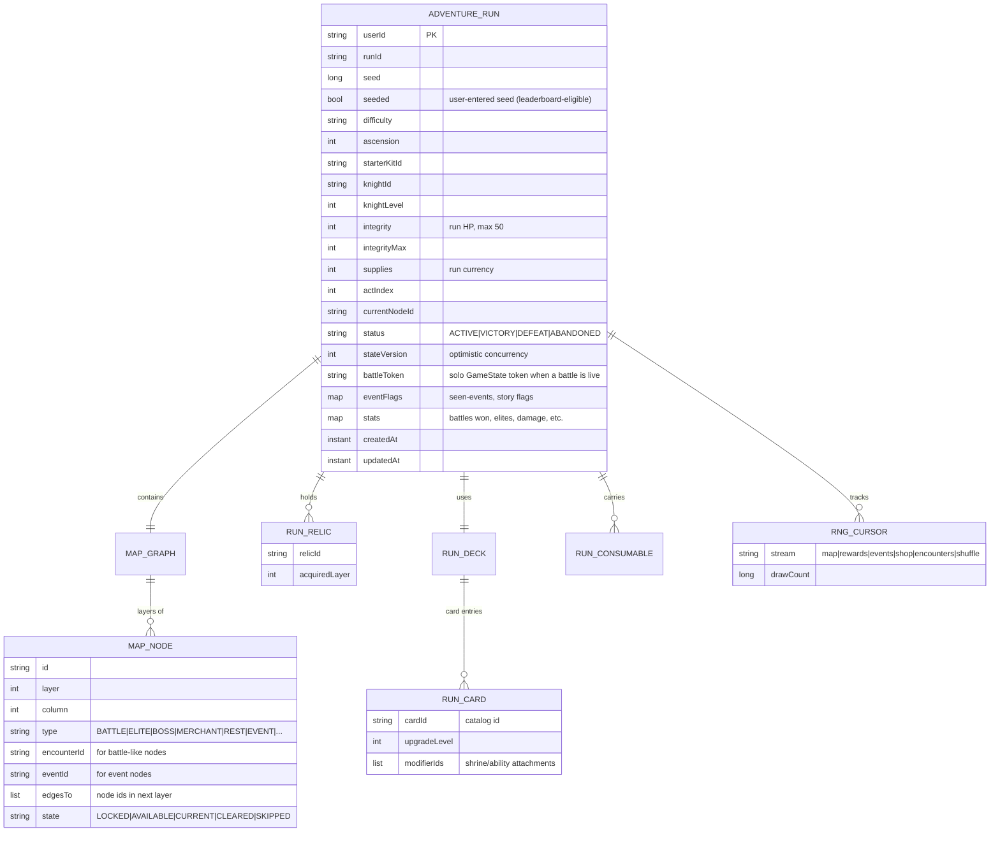
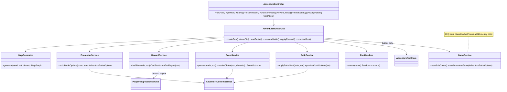

# Siegelings Roguelike Adventure Mode — Technical Implementation Plan

> Deliverables 4–12: required new systems, reused systems, folder organization, data-model and
> class-relationship diagrams, run flowchart, milestone plan, risks/refactoring, and architecture
> improvement opportunities. Grounded in `01-discovery-report.md`; design in `02-design-proposal.md`.

---

## 1. Architecture Proposal (Deliverable 3/4)

**Principle: Adventure Mode is a coordination layer above existing systems, never a fork of them.**
It is packaged as a self-contained `com.sieglings.adventure` module (package + controller + stores +
JSON content + one frontend page/section). Disabling it = one feature flag
(`app.adventure.enabled`, `@ConditionalOnProperty` on its controller/services); nothing in standard
gameplay imports adventure classes — dependencies point strictly adventure → core.

```
            ┌────────────────────────── frontend ───────────────────────────┐
            │ home.html + adventureSection (run status / new run)            │
            │ adventure.html + js/adventure.js (map, events, camps, rewards) │
            │ play.html + js/game.js  (battles — reused, adventure entry arg)│
            └───────────────▲───────────────────────────▲───────────────────┘
                            │ /api/adventure/**          │ /api/game/** (existing)
            ┌───────────────┴───────────────┐  ┌─────────┴──────────┐
            │  AdventureController (new)    │  │  GameController    │
            │  AdventureRunService (new)    │  │  GameService       │
            │   ├ MapGenerator              │──►  newAdventureGame() │  ← only core seam
            │   ├ EncounterService          │  │  BattleService …    │
            │   ├ RewardService             │  └────────────────────┘
            │   ├ EventService              │
            │   ├ RelicService              │
            │   └ RunRandom (seeded RNG)    │
            └───────────────┬───────────────┘
                            ▼
              AdventureRunStore / AdventureProfileStore (Firestore, new collections)
              resources/adventure/*.json (nodes, encounters, relics, events, kits, biomes)
```

### Systems reused as-is (Deliverable 5)

| System | Reused for |
|---|---|
| `GameService`/`BattleService`/`EffectService`/`EnergyService`/`PlacementService`/`AIService` | Every adventure battle |
| Solo-token session pattern | Battle-in-progress within a run |
| `CardDefinitionService` + live catalogs | All card/deck/trainer content, encounter deck building |
| `PlayerProgressionService` grant paths (`grantCardsWithCap`, gold/remnants, idempotency guards) | Run-end meta payouts |
| Firestore store pattern (`FirestoreUserDataClient` + store class) | Run persistence |
| Session-cookie auth filter | All adventure endpoints (adventure requires an account) |
| `DailyMissionService`, `AchievementEvaluationService`, `PlayerTitleService`, `LeaderboardService` | Adventure missions/achievements/leaderboards |
| Loadout wizard, game-over overlay, pack-reveal ceremony, binder grids, toasts, `fx.js`, `sounds.js`, `loading-gate.js` | Run setup, results, card rewards, map feedback |

### Required new systems (Deliverable 4)

1. **RunRandom** — seeded, stream-split RNG (`SplittableRandom` per subsystem: `map`, `encounters`,
   `rewards`, `events`, `shop`, `battle-shuffle`) with persisted draw counters so a reloaded run
   reproduces identical results. *This is the foundation; nothing else lands first.*
2. **AdventureRunService + AdventureRunStore** — run lifecycle (create/get/act/abandon/complete),
   optimistic state-version guard, Firestore persistence after every mutation.
3. **MapGenerator** — seeded layered-DAG generation (walker algorithm, constraint passes) from
   `biomes.json` + `node-weights.json`.
4. **EncounterService** — resolves node → enemy loadout (deck list, trainer, AI tier, modifiers,
   enemy HP) from `encounters.json`; injects into the new `GameService` seam.
5. **RewardService** — seeded card drafts, Supplies, relic drops; grants into the *run document*
   (not the collection); run-end meta payout via existing progression service.
6. **RelicService ("Sigils")** — relic definitions, acquisition, and two application hooks:
   battle-start mutations + recomputed-passive contributions (mirrors trainer-passive pattern).
7. **EventService** — event definitions, requirement checks, seeded outcome resolution.
8. **Core seam in `GameService`** — one additive method
   `newAdventureGame(AdventureBattleOptions)` accepting explicit enemy loadout, both sides' starting
   HP, battle modifiers, and a `Random` supplier. Existing `newSoloGame` delegates unchanged.
9. **Frontend** — `adventure.html` + `js/adventure.js` (map render, node interactions, event dialog,
   relic tray, run summary) + a hub `adventureSection`; `play.html` gains an
   `?adventure=<runToken>` entry that skips the loadout wizard and returns to the map on game over.

### Folder / file organization (Deliverable 6)

```
src/main/java/com/sieglings/adventure/
├── AdventureController.java
├── AdventureRunService.java
├── map/        MapGenerator.java, MapGraph.java, MapNode.java, NodeType.java (enum)
├── run/        AdventureRun.java, RunDeck.java, RunSiegeling.java, RunConsumable.java,
│               RunRandom.java, RunStatus.java (enum), DifficultyTier.java (enum)
├── encounter/  EncounterService.java, EncounterDefinition.java, AiProfile.java, BattleModifier.java
├── reward/     RewardService.java, CardDraft.java, RunRewardBundle.java
├── relic/      RelicService.java, RelicDefinition.java, RelicTrigger.java (enum)
├── event/      EventService.java, EventDefinition.java, EventChoice.java, EventOutcome.java
└── content/    AdventureContentService.java  (loads/validates all JSON below)

src/main/java/com/sieglings/persistence/
├── entity/AdventureRunEntity.java, AdventureProfileEntity.java
└── firestore/AdventureRunStore.java, AdventureProfileStore.java

src/main/resources/adventure/
├── biomes.json  node-weights.json  encounters.json  relics.json
├── events.json  starter-kits.json  difficulty.json  consumables.json

src/main/resources/static/
├── adventure.html
├── js/adventure.js          css/adventure.css
└── img/adventure/           (node icons, relic icons, biome backdrops)

src/test/java/com/sieglings/adventure/   (MapGeneratorTest, RunRandomTest, EncounterServiceTest,
                                          RewardServiceTest, EventServiceTest, determinism suite)
```

---

## 2. Data Models (Deliverable 7)



`AdventureProfileEntity` (meta, separate doc): unlocked kits/relics/ascension per kit, lifetime
stats, daily-seed attempt marker, best runs. Content JSON models (`EncounterDefinition`,
`RelicDefinition`, `EventDefinition`, `BiomeDefinition`, `StarterKitDefinition`) are read-only
classpath data validated at startup by `AdventureContentService` against the live card catalog
(unknown card id → startup warning, node falls back to a safe default — same resilience philosophy
as the card-override system).

## Class relationships (Deliverable 8)



## Complete run flowchart (Deliverable 9)

```mermaid
flowchart TD
    A[Hub: Adventure section] -->|active run?| B{Run exists}
    B -->|no| C[Run setup wizard:\nknight / kit / difficulty / seed]
    C --> D[POST /api/adventure/run/new\nseed -> RunRandom -> MapGenerator]
    B -->|yes| E[Load map screen\nGET /api/adventure/run]
    D --> E
    E --> F[Player picks reachable node\nPOST /travel]
    F --> G{Node type}
    G -->|Battle/Elite/Mini-Boss/Boss| H[EncounterService builds enemy loadout\nRelicService battle-start hooks\nGameService.newAdventureGame -> battleToken]
    H --> I[play.html?adventure=token\nexisting battle client]
    I --> J{Result}
    J -->|Victory| K[Write back Integrity\nRewardService: Supplies + card draft\n(+ relic on Elite/Boss)]
    J -->|Defeat| L[Run status DEFEAT]
    G -->|Merchant| M[Supplies shop: cards/relics/removal]
    G -->|Rest Camp| N[Rest / Train upgrade / Commune]
    G -->|Event/Mystery| O[EventService: narrative + choices\nseeded outcome]
    G -->|Treasure/Shrine/Recruit/Utility| P[Direct reward pickers]
    K --> Q{Boss node?}
    M --> E
    N --> E
    O --> E
    P --> E
    Q -->|no| E
    Q -->|act boss, acts left| R[Next act: MapGenerator(seed, act+1)]
    R --> E
    Q -->|final boss| S[Run status VICTORY]
    S --> T[Run summary screen\nRewardService.runEndPayout:\nSiegecoins/Remnants/unlocks/achievements\n(idempotent, existing grant path)]
    L --> T
    T --> A
```

---

## 3. Determinism & Seeding Strategy (coding constraint)

- One `long` run seed (user text hashed, or random). All randomness inside a run flows through
  `RunRandom.stream(name)` — named `SplittableRandom` streams split from the seed, with **persisted
  draw counters** replayed on load so a resumed run continues the same sequence.
- Map, node assignment, encounter composition, drafts, relic offers, event outcomes, merchant
  stock: all seeded. Battle deck shuffles use the `shuffle` stream via the new `GameService` seam
  (standard mode keeps its unseeded RNG — zero behavior change).
- What stays *outside* the seed: player choices and battle tactics — that's the skill expression a
  seeded leaderboard measures. AI decisions are heuristic (deterministic given state), so replays of
  identical player actions reproduce identical fights.
- Leaderboard-readiness: run doc records `seeded`, seed, difficulty, kit, final stats, and a
  server-computed score; a future `adventure` leaderboard slots into the existing
  `LeaderboardService` refresh model. Server-authoritative resolution means no client-side trust
  issues to solve later.

---

## 4. Milestone Plan (Deliverable 10)

Complexity: S/M/L/XL · Risk: 🟢 low / 🟡 medium / 🔴 high

### Phase 1 — Run foundation (backend-heavy)
| Work item | Files/classes | Depends on | Cx | Risk |
|---|---|---|---|---|
| `RunRandom` + determinism test suite | `adventure/run/RunRandom.java`, tests | — | S | 🟢 |
| Run entities + stores + collections | `AdventureRunEntity`, `AdventureProfileEntity`, `AdventureRunStore`, `AdventureProfileStore`, `FirestoreUserDataClient` (+2 collection accessors) | — | M | 🟢 |
| Content loader + first JSON (biomes, node weights, starter kits) | `AdventureContentService`, `resources/adventure/*.json` | — | M | 🟢 |
| `MapGenerator` (walker + constraints) | `adventure/map/*` | RunRandom | M | 🟡 graph-quality tuning |
| `AdventureRunService` + `AdventureController` (new/get/travel/abandon) | `adventure/` | all above | M | 🟡 state-machine edge cases |
| Map UI + hub entry + run-setup wizard | `adventure.html`, `js/adventure.js`, `css/adventure.css`, `home.html/js` (nav entry) | controller | L | 🟡 net-new screen |

**Exit criteria:** create a seeded run, see the map, travel node-to-node (non-battle nodes stubbed), resume across restart, identical map for identical seed.

### Phase 2 — Battles, rewards, recruitment
| Work item | Files/classes | Depends on | Cx | Risk |
|---|---|---|---|---|
| `GameService.newAdventureGame` seam (`AdventureBattleOptions`: enemy loadout, HP overrides, RNG) | `GameService.java` (additive), `GameController` or `AdventureController` bridge | Phase 1 | M | 🔴 only core-code touchpoint — regression-test standard solo/multiplayer |
| `EncounterService` + `encounters.json` (Act 1 set) | `adventure/encounter/*` | seam | M | 🟡 balance |
| Battle entry/exit wiring in `play.html`/`game.js` (`?adventure=` mode, skip wizard, return-to-map on game over, Integrity display) | `game.js` (scoped additions) | seam | M | 🟡 15k-line file — keep changes additive/flag-gated |
| `RewardService`: Supplies, card drafts (reuse pack-reveal UI), Integrity write-back | `adventure/reward/*`, `adventure.js` | encounter | M | 🟢 |
| Recruit nodes + run-deck management UI (view/replace lines) | reward + `adventure.js` | rewards | M | 🟢 |
| Run-end payout via `PlayerProgressionService` (idempotent, `rewardedRunIds`-style guard) | `RewardService`, progression touchpoint | rewards | S | 🟢 |

**Exit criteria:** full Act-1 run playable start→boss with battles, drafts, recruitment, defeat/victory summaries, meta payout.

### Phase 3 — Relics, events, elites, bosses
| Work item | Files/classes | Depends on | Cx | Risk |
|---|---|---|---|---|
| `RelicService` + `relics.json` (battle-start + recomputed-passive hooks; a few new `AbilityEffectKeys` if needed) | `adventure/relic/*`, `EffectService` (additive keys) | Phase 2 | L | 🟡 combat interaction testing |
| `EventService` + `events.json` (30+ events) + event dialog UI | `adventure/event/*`, `adventure.js` | Phase 1 | M | 🟢 content-heavy, logic-light |
| Elite/boss modifiers + `AiProfile` tiers | `encounter/*`, `AIService` (strategy wrapper) | Phase 2 | M | 🟡 |
| Merchant, rest camp (Train/Commune), shrines, utility nodes | services + `adventure.js` | rewards | M | 🟢 |
| Acts 2–3 biomes, difficulty tiers, curses, consumables | content JSON + small hooks | all | M | 🟡 balance |

### Phase 4 — Polish, persistence hardening, meta
| Work item | Files/classes | Cx | Risk |
|---|---|---|---|
| Map/reward/relic FX + sounds + biome transitions (reuse `fx.js`, `sounds.js`, loading art) | `adventure.js` | M | 🟢 |
| Node icons, relic icons, biome backdrops | `img/adventure/` | M | 🟢 asset production |
| Resume/abandon edge cases, mid-battle disconnect recovery (battleToken re-attach), state-version conflict handling | run service | M | 🟡 |
| Adventure missions/achievements/titles; run archive; daily-seed run + attempt gating | mission/achievement catalogs, `AdventureProfileStore` | M | 🟢 |
| Ascension ladder + balancing pass; (post-MVP: endless, mutators, seeded leaderboard) | content + `LeaderboardService` | L | 🟡 |

---

## 5. Risks & Refactoring Recommendations (Deliverable 11)

1. **🔴 `GameService` seam regression risk.** The one core edit must be purely additive. Mitigate:
   introduce `AdventureBattleOptions` as a superset wrapper, keep `newSoloGame` byte-for-byte
   delegating, and lean on the existing `GameServiceTest`/`BattleServiceTest` suites plus a new
   adventure-battle test before any UI work.
2. **🔴 In-memory battle vs. durable run.** A server restart mid-battle loses the `GameState` but
   not the run. Design for it from day 1: the run stores `battleToken` + node id; if the token is
   dead, the node re-arms (re-entering rebuilds the same encounter deterministically via the
   `encounters` RNG stream — replaying the fight, not skipping it). Document that mid-battle
   tactical state is intentionally ephemeral, matching existing solo behavior.
3. **🟡 Firestore write amplification.** Persisting after every map action is fine (runs are
   low-frequency), but battles must NOT write per-action — only battle start (token) and battle end
   (results). Keep the run doc under Firestore's 1 MiB limit: store the map compactly (node type
   ids + edge indexes, not verbose objects).
4. **🟡 Frontend monoliths.** Do not grow `game.js`/`home.js`. All adventure UI lives in
   `adventure.js`; touches to `game.js` limited to the adventure entry/exit branch. Recommended
   opportunistic refactor: extract game.js's auth/config/api helpers into a shared
   `js/api-client.js` consumed by all three pages (small, high-value, low-risk).
5. **🟡 Balance unknowns.** Curated encounter decks vs. player-built run decks is a new balance
   surface. Mitigate with data-driven budgets (`difficulty.json`), the existing card dashboard
   philosophy (consider Firestore overrides for adventure content in Phase 4 so tuning doesn't need
   deploys), and telemetry in run stats.
6. **🟡 Determinism leaks.** Any `new Random()` sneaking into adventure paths breaks seeded runs.
   Enforce via the determinism test suite (fixed seed → assert identical map/draft/event
   transcripts) and code-review convention: adventure code may only draw randomness from
   `RunRandom`.
7. **🟢 Auth requirement.** Guests can play solo matches today; adventure requires persistence, so
   gate it on login (existing pattern: guarded controllers + `renderAuthDependentSurfaces` on the
   frontend nudges sign-in).

## 6. Architecture Improvement Opportunities (Deliverable 12)

Improvements that integrating Adventure Mode naturally motivates — each optional, none blocking:

1. **Seedable RNG injection in core services** (`Random` supplier on `StartOptions`) — also enables
   reproducible bug reports and deterministic tests for *standard* matches.
2. **Formalize `StartOptions` into a builder/options object** covering enemy loadout and HP — kills
   the current hard-coded 50-HP literals and random-enemy coupling, useful for future PvE beyond
   adventure (tutorials, puzzle battles, boss rushes).
3. **Shared frontend API client** (`js/api-client.js`) extracted from the three page scripts —
   reduces drift between hub/match/adventure network code.
4. **Reward-grant unification**: `awardMatchGold` + tutorial + missions each hand-roll idempotency;
   a small `RewardLedger` helper (grant-once-by-key) would serve match, mission, and adventure
   payouts uniformly.
5. **Content-validation startup report**: `AdventureContentService`'s validate-against-catalog pass
   could be generalized to also lint preset decks/trainer references, catching dashboard-edit
   breakage earlier (a failure mode the handoff doc already warns about).
6. **Match-history generalization**: `MatchHistoryEntity` gains an optional `contextType/contextId`
   (`ADVENTURE`, runId) instead of a parallel history system — one queryable battle log across
   modes.

---

*End of Phase 1 + Phase 2 deliverables. Implementation will not begin until this discovery package
is reviewed and approved.*
